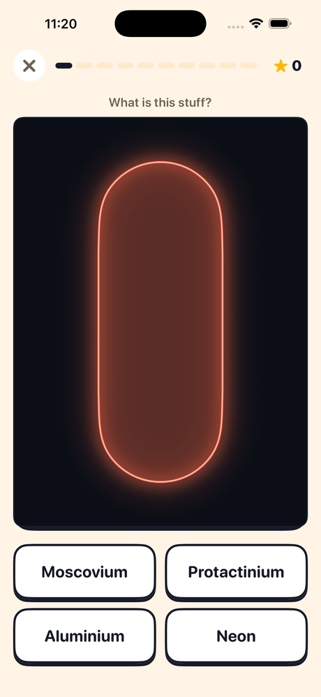
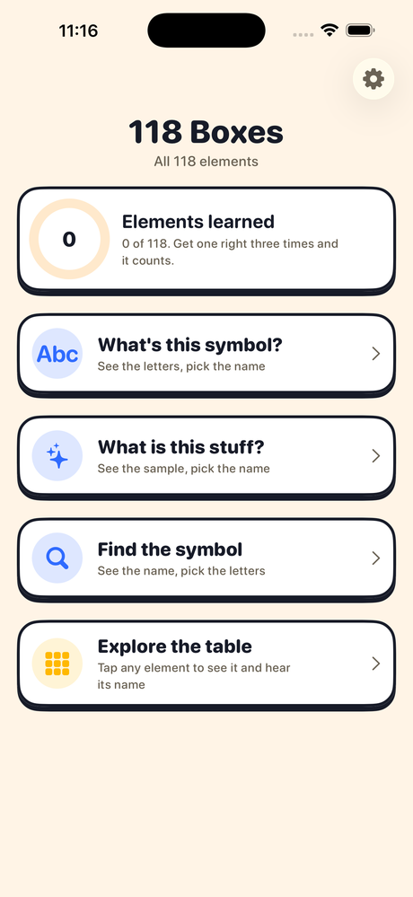
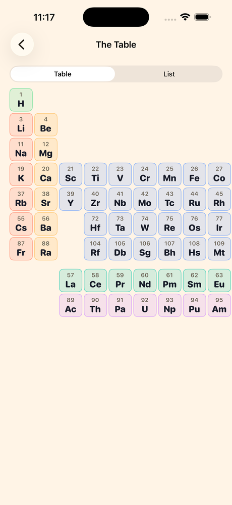
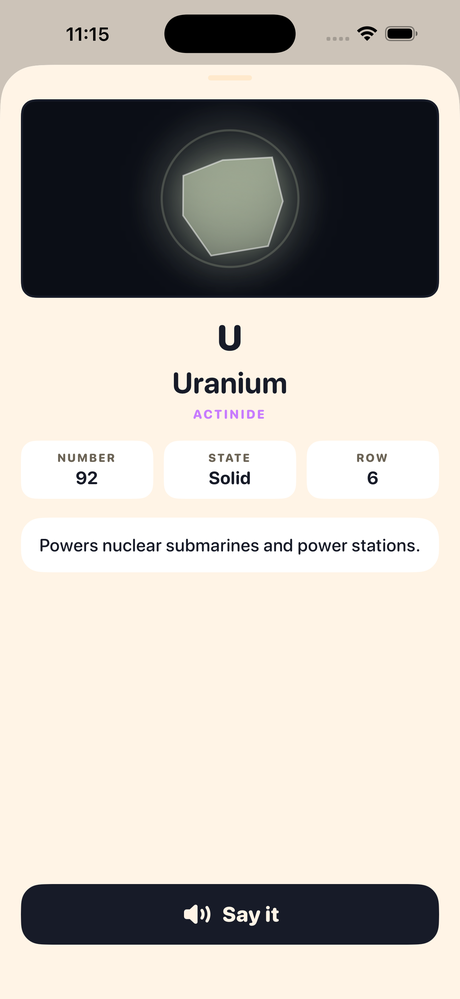

# 118 Boxes

**A periodic table for children who are reading ahead of their vocabulary.**

My six-year-old could read the word *magnesium*. They had never heard it. So every
element name is read out loud, and every element shows a picture of what the
stuff actually looks like.

[riz.io/118-boxes](https://riz.io/118-boxes) · iPhone and iPad · iOS 17 · No ads,
no tracking, no network

<p align="center">
  
  
  
  
</p>

## Not one of these is a photograph

This is the interesting part. Photographs of 118 element samples are either
unlicensed or unaffordable, which is why so many periodic table apps quietly
show you nothing at all.

Every sample here is drawn in SwiftUI from three facts about the element: its
colour, its state at room temperature, and the shape a real sample comes in.
Gold is a cast bar. Copper, a coil of wire. Mercury pools. The noble gases glow
in discharge tubes, and anything radioactive pulses.

| Form | Looks like | Who gets it |
|---|---|---|
| `chunk` | irregular lump | iron, sodium, most rare earths |
| `ingot` | cast bar with a bevelled top | gold, silver, aluminium, tin |
| `pellets` | little beads | calcium, nickel, zinc |
| `powder` | a settled heap with specks | sulfur, carbon, selenium |
| `crystal` | faceted cluster | iodine, silicon, bismuth |
| `wire` | a coil with a loose end | copper, magnesium |
| `pool` | droplets and a puddle | mercury, bromine |
| `cloud` | drifting glow | hydrogen, oxygen, chlorine |
| `tube` | glowing discharge tube | the noble gases |
| `shard` | glowing, with a pulsing ring | anything radioactive |

Metals get a hard sheen, everything else stays matte. Lump shapes come from a
seeded RNG keyed to the atomic number, so an element always draws itself the
same way. Well-known elements have their form pinned by hand in
`ChemElement.knownForms`; the rest is derived from family and atomic number.

See [`Sources/Views/ElementArt.swift`](Sources/Views/ElementArt.swift).

## Three rounds

| Round | Question | Answers |
|---|---|---|
| **Read it** | the symbol, `Mg` | four names |
| **Recognise it** | the sample | four names |
| **Recall it** | the name | four symbols |

Ten questions each, then a score and up to three stars. Anything they get wrong
is listed at the end with its picture, so the mistakes are the last thing they
see.

Wrong answers in the picture round are chosen to *look different* from the right
one. Without that it is a coin toss rather than a question.

## How it picks what to ask

All 118 are in play from the first question. Nothing is locked and nothing is
earned. The picker just weights things: elements they have not met come up more
often, ones they have come up less, and the first 36 get a nudge because that is
where the familiar names live. Three correct answers and an element counts as
learned.

See `QuizEngine.buildRound`.

## No network code

Not "minimal tracking" — none. There is no HTTP client, no analytics SDK, no
advertising library and no third-party dependency of any kind, so there is no
mechanism by which anything could leave the device. Progress and settings are
SwiftData and `@AppStorage`, and go when the app does.

The `PrivacyInfo.xcprivacy` manifest declares exactly one required-reason API,
`UserDefaults` under `CA92.1`, and no collected data types.

## Accessibility

- Dynamic Type throughout, including the accessibility sizes
- VoiceOver describes each drawn sample by **appearance** — form, sheen, state —
  and deliberately not by name, since naming it would give away the answer in
  the picture round while saying nothing would make that round unplayable
- Element names are spoken by `AVSpeechSynthesizer`, with a voice picker in
  Settings listing the English voices installed on the device

## Build

Requires Xcode and [XcodeGen](https://github.com/yonyz/XcodeGen)
(`brew install xcodegen`).

```sh
xcodegen generate      # regenerates Boxes118.xcodeproj from project.yml
open Boxes118.xcodeproj
```

The Xcode target is `Boxes118`, not `118Boxes`, because a Swift module name
cannot begin with a digit. Only `CFBundleDisplayName` is user-visible.

The app icon is generated: `python3 scripts/make_icon.py`.

Shipping to TestFlight: [`scripts/TESTFLIGHT.md`](scripts/TESTFLIGHT.md).

## Adding to the facts

All element data is one array in
[`Sources/Models/ElementData.swift`](Sources/Models/ElementData.swift). Each row
is atomic number, symbol, name, family, state, colour and a one-sentence fact.
Facts are written for an early reader: one short sentence, ideally something
they could point at in the real world.

## Licence

MIT. See [LICENSE](LICENSE).
